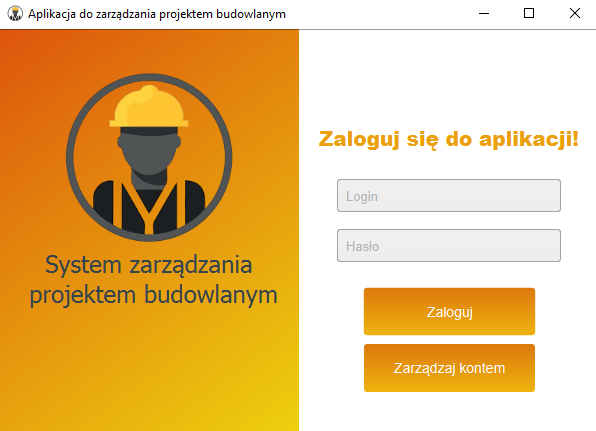
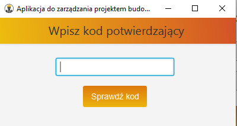
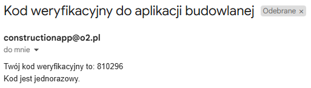
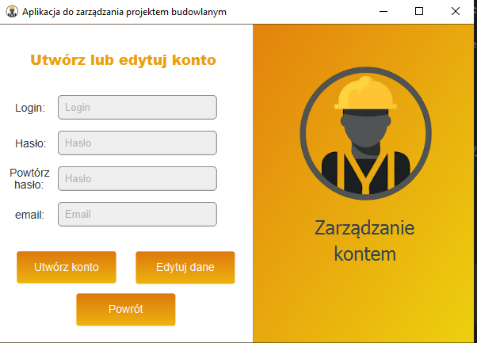
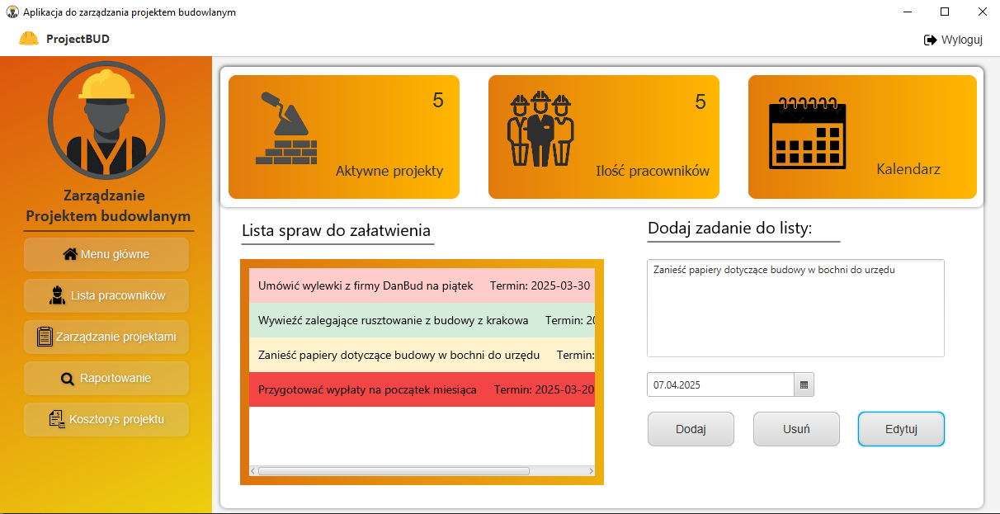
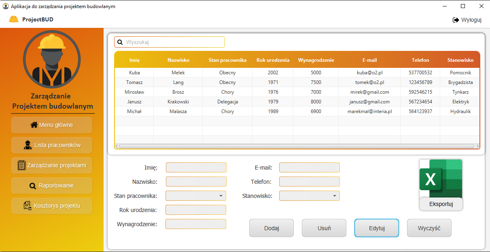
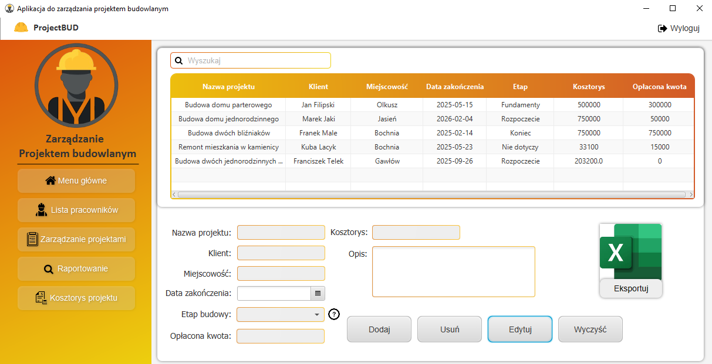
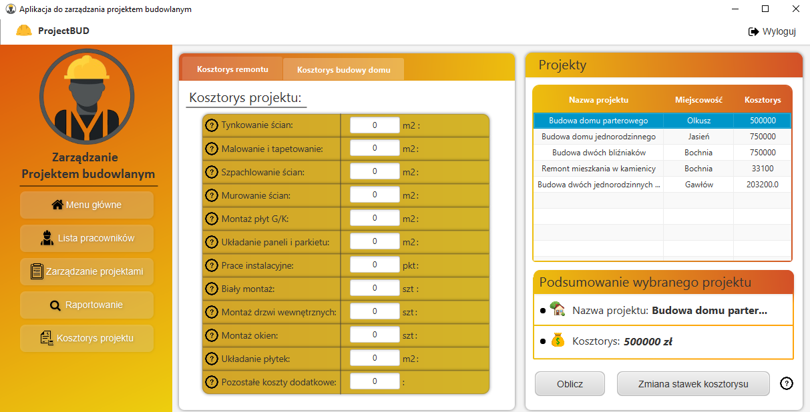
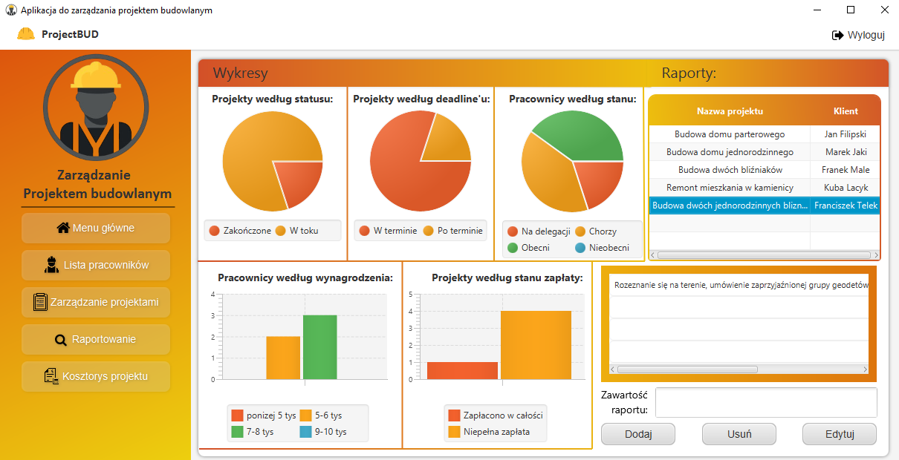

# Construction project management

## Description

Construction Project Management is a window application for managing a construction project for small construction companies. The aim of the application was to create an intuitive and simple application. The sector to which the application is directed still prefers to use traditional solutions such as sheets or notebooks in written form. The program aims to increase the efficiency of these companies by using more modern solutions.

## Technologies
- **Java**
- GUI: **JavaFX**
- Project management: **Maven**
- Database: **MySQL** with library **JDBC**
- Unit testing: **JUnit 5**
- **CSS**

## Main functionalities of the program

- Employee list management
- Construction project management
- Project cost estimate
- Work reporting
- Login panel
- Controlling session time (without user activity)

## Images of program

- Login panel:

Window for two-factor verification when logging in via a code sent to email:

- Registration:

Home page:

Employee list management:

Construction project management:

Project cost estimate:

Reports with company charts:

